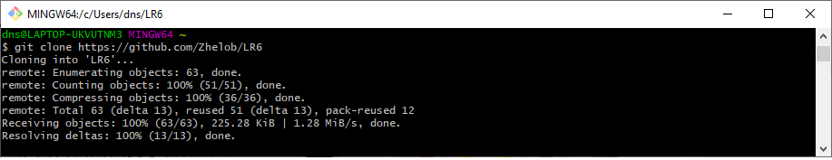
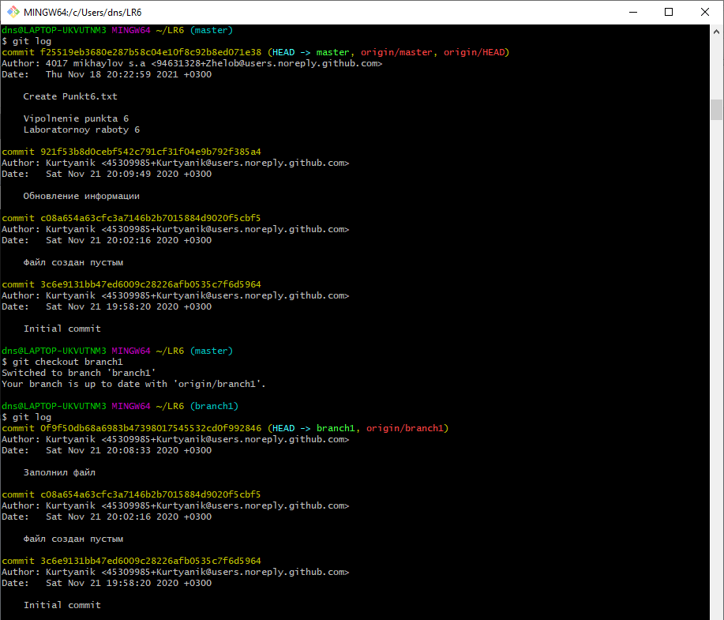
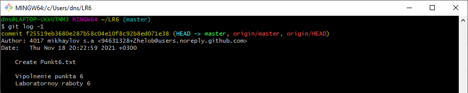
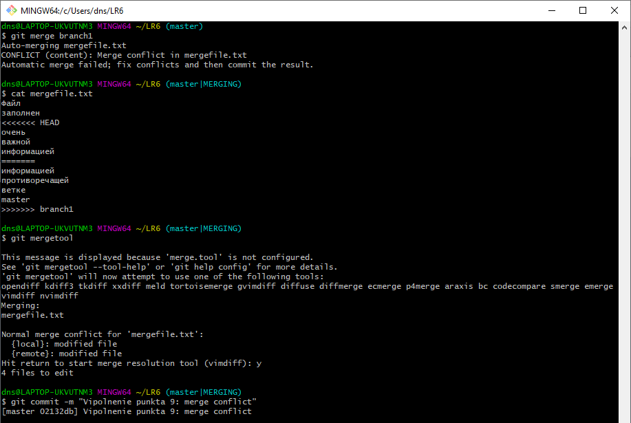
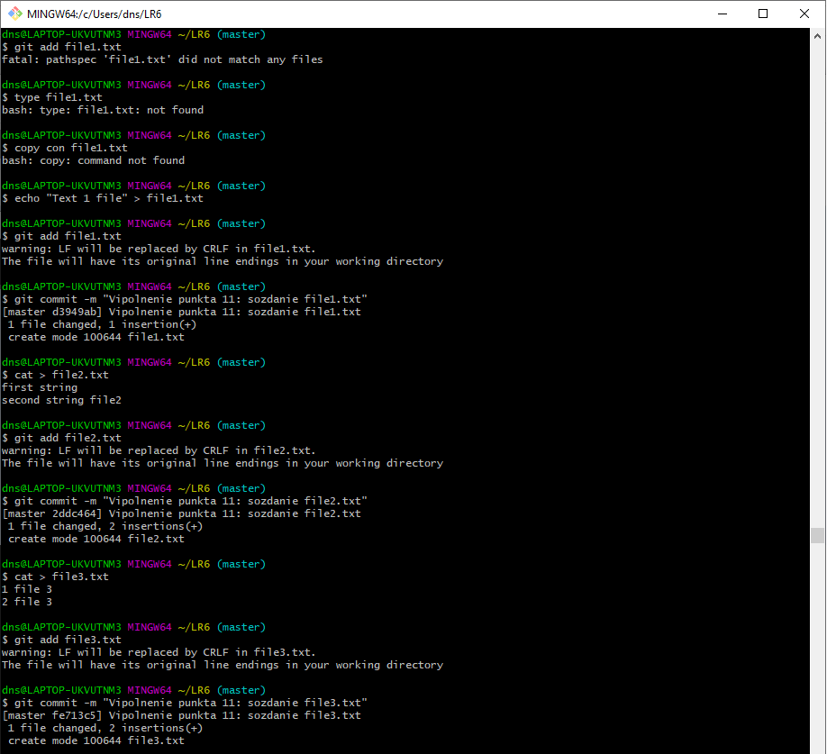
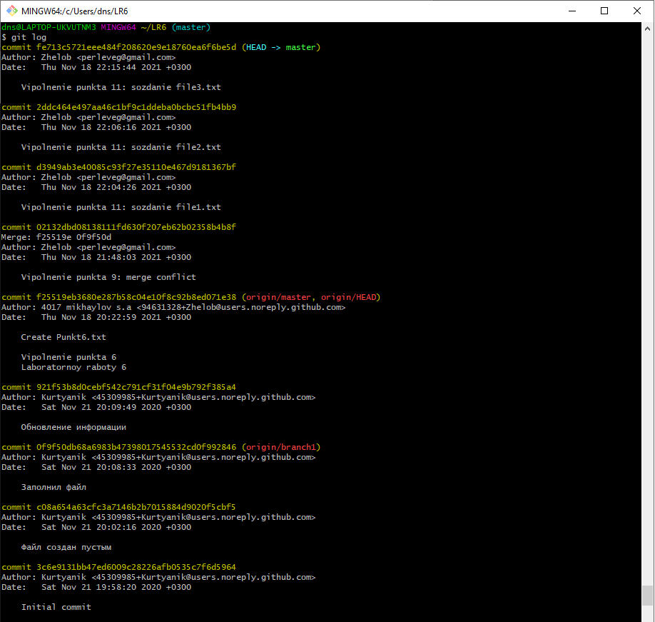
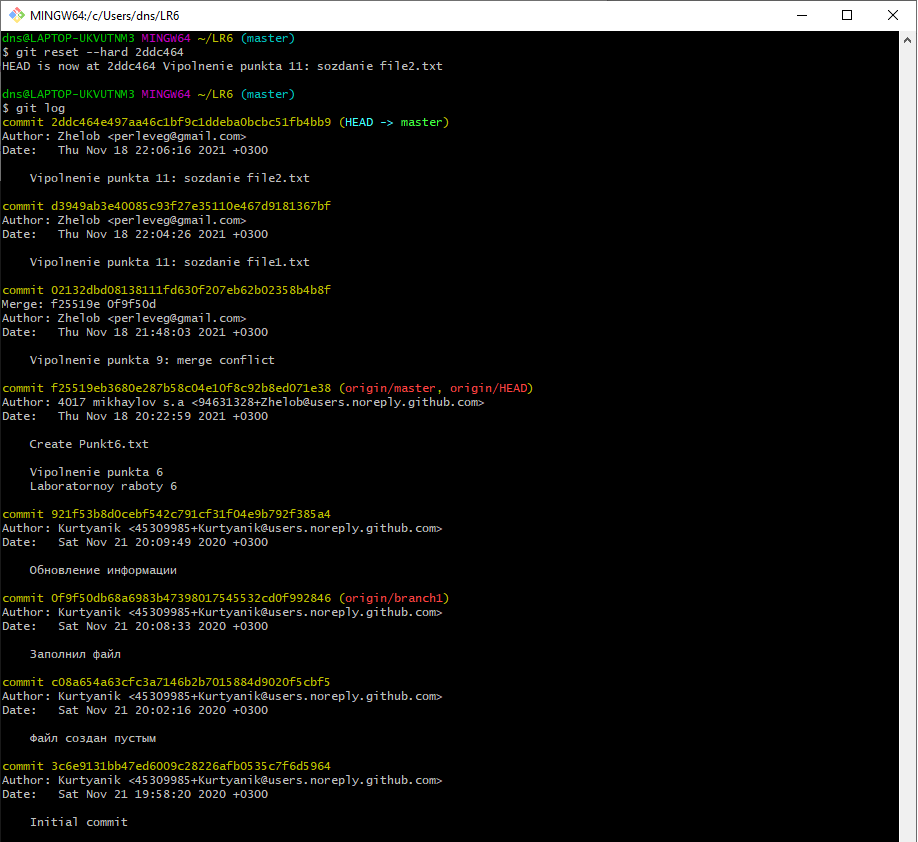
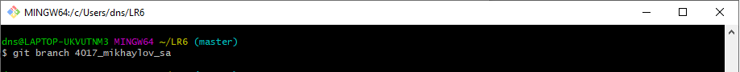

# LR6

Лабораторная работа №6

1.  Создан аккаунт на сайте GitHub. 

2.  Сделана  копия  в  личное  хранилище  из 
https://github.com/Kurtyanik/LR6/ (Fork). 

3.  Установлен Git (https://git-scm.com/). 

4.  После установки настроен клиент git\

5.  Клонирован удалённый репозиторий на компьютер\

6.  Добавлен  файл  через  интерфейс  GitHub.  Внесены  изменения  в локальный репозиторий.\
 

7.  Получена история операций для каждой из веток.\

8.  Просмотрены последние изменения..\
 

9.  Выполнено  слияние  в  ветку  master,  разрешив  конфликт..\

10.  Удалена побочная ветка после успешного слияния..\

 
11.  Сделаны  изменения  и  зафиксированы несколько раз.\
 

12.  Сделан «хард» откат коммита.\

13.  Создана ветка для отчёта.\
 

14.  Оформлен  отчёт  в  файле  README.md 

 
15.  Получена  история  операций  в  форматированном  виде  (сокращённый хэш  +  дата  +  имя  автора  +  комментарий).\
 

16.  Отправить  локальные  изменения  в  сетевое  хранилище  GitHub.

Лог команд:
    1  git config
    2  git config --global user.name "Zhelob"
    3  git config --global user.email perleveg@gmail.com
    4  git clone https://github.com/Zhelob/LR6
    5  cd LR6
    6  git pull
    7  git log
    8  git checkout branch1
    9  git log
   10  git checkout report
   11  git log
   12  git checkout master
   13  git log -1
   14  git merge branch1
   15  cat mergefile.txt
   16  git mergetool
   17  git commit -m "Vipolnenie punkta 9: merge conflict"
   18  git merge branch1
   19  git branch -d branch1
   20  echo "Text 1 file" > file1.txt
   21  git add file1.txt
   22  git commit -m "Vipolnenie punkta 11: sozdanie file1.txt"
   23  cat > file2.txt
   24  git add file2.txt
   25  git commit -m "Vipolnenie punkta 11: sozdanie file2.txt"
   26  cat > file3.txt
   27  git add file3.txt
   28  git commit -m "Vipolnenie punkta 11: sozdanie file3.txt"
   29  git log
   30  git reset --hard 2ddc464
   31  git log
   32  git branch 4017_mikhaylov_sa
   33  git checkout 4017_mikhaylov_sa
   34  md screens
   35  mkdir screens
   36  touch readme_new.md
   37  git log --pretty=format:"%h: %ad, %an: %s"
   38  history
   
