# LR6

Лабораторная работа №6

1.  Создан аккаунт на сайте GitHub. 

2.  Сделана  копия  в  личное  хранилище  из 
https://github.com/Kurtyanik/LR6/ (Fork). 

3.  Установлен Git (https://git-scm.com/). 

4.  После установки настроен клиент git\
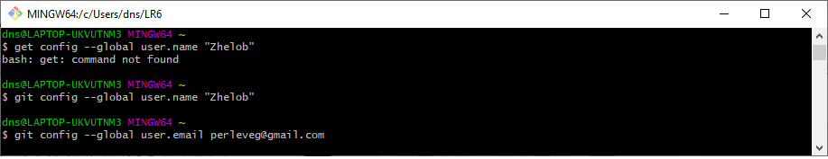

5.  Клонирован удалённый репозиторий на компьютер\
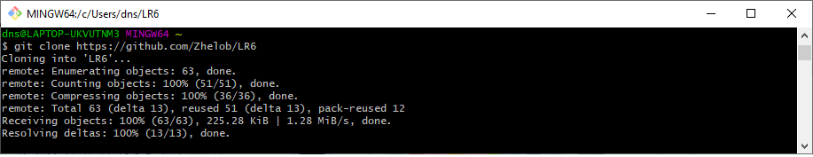

6.  Добавлен  файл  через  интерфейс  GitHub.  Внесены  изменения  в локальный репозиторий.\
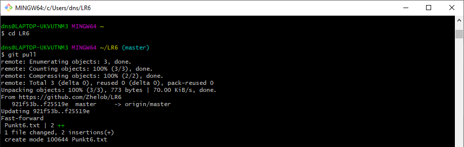 

7.  Получена история операций для каждой из веток.\
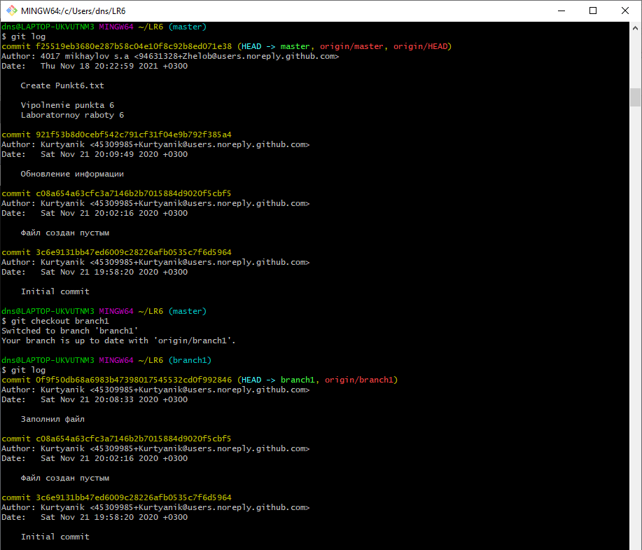

8.  Просмотреть последние изменения..\
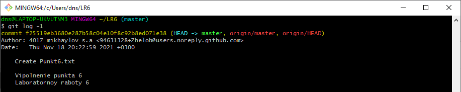 

9.  Выполнить  слияние  в  ветку  master,  разрешив  конфликт..\
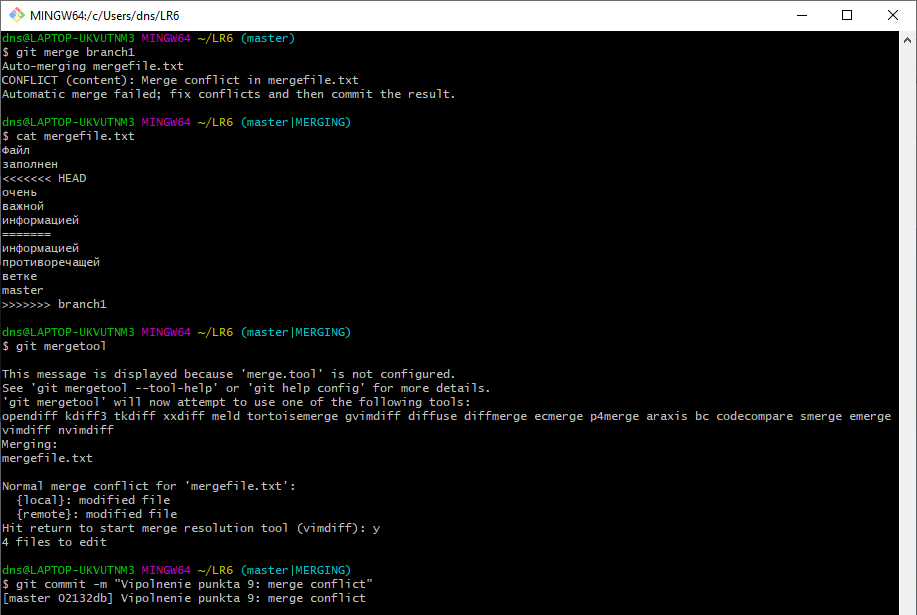

10.  Удалить побочную ветку после успешного слияния..\
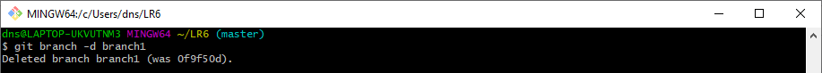
 
11.  Сделать  изменения  и  зафиксировать  их,  оставляя  комментарии, несколько раз.\
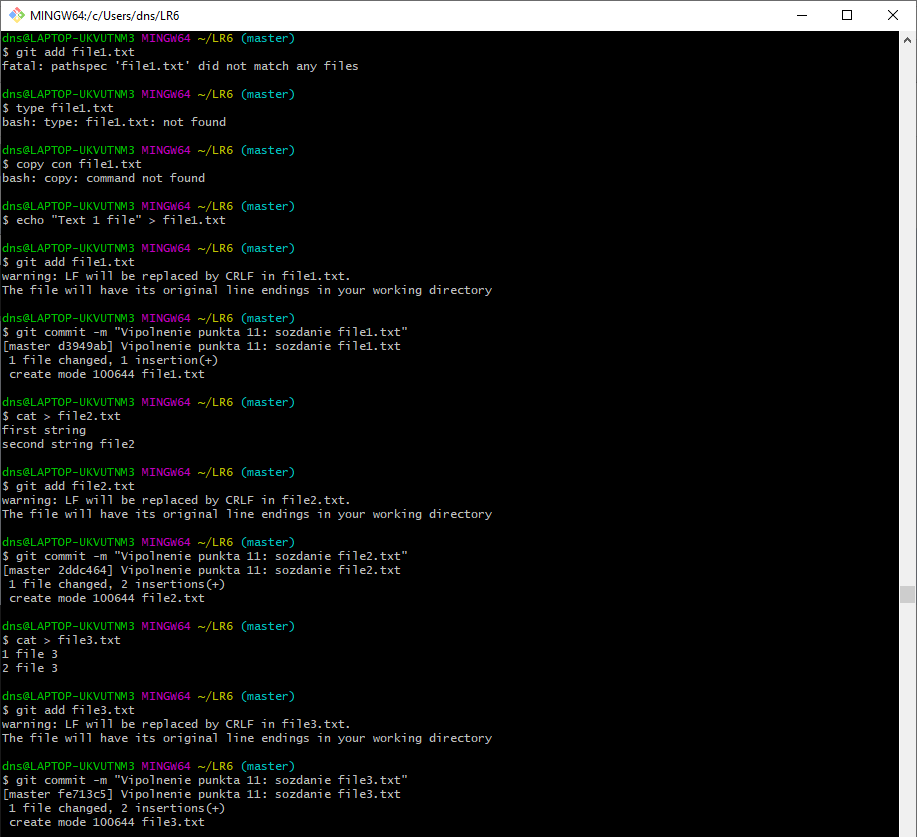 

12.  Сделать «хард» откат коммита.\
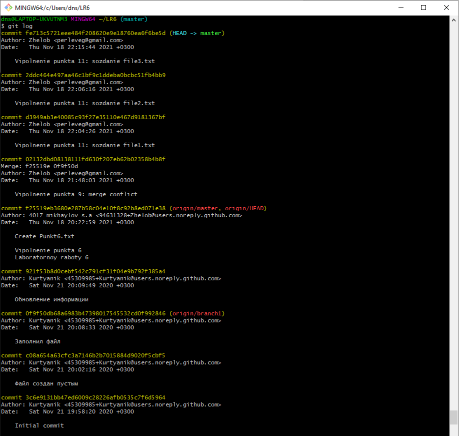
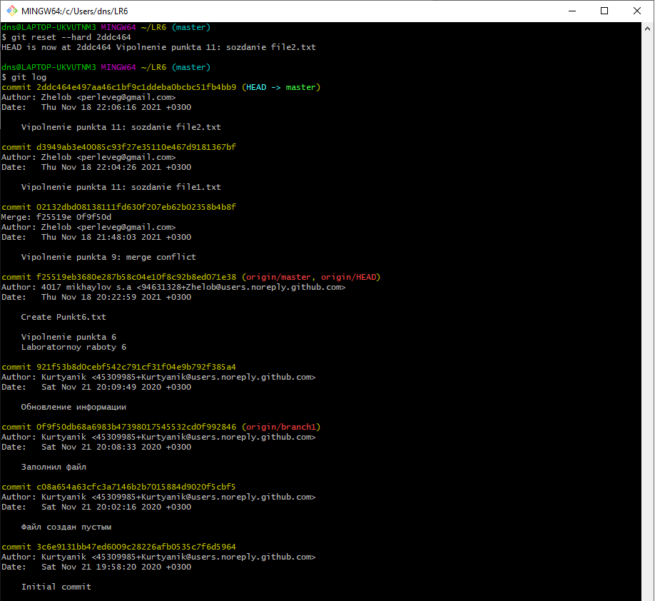

13.  Создать ветку для отчёта..\
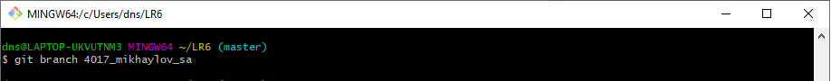 

14.  Оформить  отчёт  в  файле  README.md 

 
15.  Получить  историю  операций  в  форматированном  виде  (сокращённый хэш  +  дата  +  имя  автора  +  комментарий).  Добавить  её  в  отчёт  и  сделать финальную фиксацию изменений. 

16.  Отправить  локальные  изменения  в  сетевое  хранилище  GitHub.
